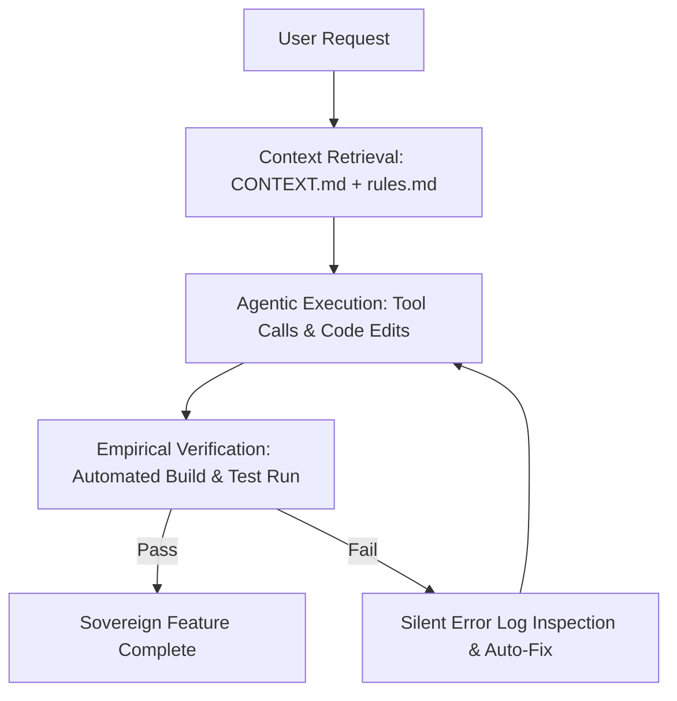

> [!KEY TAKEAWAY]
> An **Agentic Harness** is a structured local environment—which can scale pragmatically from a single high-density `CONTEXT.md` file up to multi-layer rules, tool protocols (MCP), and verification loops—that constrains and orchestrates Large Language Models into deterministic execution partners. Grounding AI in local file context eliminates architectural drift, token waste, and cognitive fatigue.

*This guide was designed for [Google Antigravity](https://antigravity.google/) users.*

> [!NOTE] Freedom of Context: Start Simple
> You do **not** need to enforce a rigid multi-directory harness when starting out. As a pragmatic programmer, your harness will often consist of a **single `CONTEXT.md` file** containing your project instructions, boundaries, and stack rules. The multi-layer framework (rules, skills, MCP APIs, subagents) is simply a modular architecture that grows organically as your project scales.

---

## What is an Agentic Harness?

**An Agentic Harness is the deterministic software scaffolding that surrounds a non-deterministic Large Language Model.** Rather than letting an AI model guess your project conventions from a blank prompt, the harness supplies structured workspace memory, tools, and execution boundaries.

> "Context accounts for 90% of an autonomous agent's real-world capability; the remaining 10% comes from the underlying foundation model."

An Agentic Harness consists of four foundational layers:
1. **System Instructions & Boundaries**: Establishing persona, conventions, and non-negotiable constraints.
2. **Persistent Workspace Memory**: Retaining project architecture via local Markdown (`CONTEXT.md`).
3. **Tool Registries (MCP APIs)**: Connecting AI to local filesystems, terminal shells, and external APIs via the Model Context Protocol.
4. **Empirical Verification Loops**: Automatically running build commands and tests after code modifications to catch errors before deployment.

---

## Why does AI need structured context?

**Without structured local context, AI models operate as blank slates with zero memory of your codebase conventions, API schemas, or architectural constraints.** Relying solely on raw prompts leads to three critical failure modes:

1. **Hallucination & Architectural Drift**: The model imports non-existent libraries, fabricates parameter types, and violates project patterns.
2. **Cognitive Fatigue**: The developer wastes hours re-explaining folder hierarchies and tech stack rules in every prompt.
3. **Broken Vibe Coding**: Unconstrained code generation creates fragile, untracked modifications that fail silently in production.

> [!IMPORTANT] The Context Window Principle
> Grounding an AI in local project context bridges the gap between raw LLM capabilities and your exact project reality. By organizing context into local Markdown files, you index memory deterministically, eliminating noise and transforming the AI into a high-precision execution partner.

---

## How to Scale an Agentic Harness: Single File to Multi-Layer

A harness should match the complexity of the project. You can scale your architecture across three progressive tiers:

```text
TIER 1: Single-File Harness (Pragmatic / Fast)
my-project/
└── CONTEXT.md                  # All architecture, conventions, and rules in one file

TIER 2: Modular Triad Harness (Standard)
my-project/
├── CONTEXT.md                  # High-Level Architecture & Tech Stack
├── .agents/
│   └── rules.md                # Non-Negotiable Coding Rules & Boundaries
└── skills/
    └── deploy/SKILL.md         # Reusable Workflow Cheatsheets

TIER 3: Autonomous Super-Station (Advanced)
my-project/
├── CONTEXT.md + .agents/rules.md
├── skills/ (Domain Workflows)
├── mcp/ (Tool Server Schemas)
└── subagents/ (Background Worker Orchestration)
```

### Comparative Architecture Matrix

| Dimension | Fragile Blank Prompting | Single-File Harness (`CONTEXT.md`) | Multi-Layer Agentic Harness |
| :--- | :--- | :--- | :--- |
| **Setup Overhead** | Zero setup (high prompt friction) | Minimal (5 minutes to write `CONTEXT.md`) | Moderate (modular directories) |
| **Context Retention** | Lost after session reset | Persistent across sessions | Persistent + modularized by domain |
| **Architectural Drift** | High (frequent hallucinations) | Low (anchored to root document) | Zero (enforces explicit rule files) |
| **Tool Execution** | None (chat window only) | Direct CLI / IDE integration | Model Context Protocol (MCP) servers |
| **Verification Loop** | Manual copy-pasting | Automated test/build execution | Automated multi-agent validation |
| **Ideal Project Size** | One-off throwaway queries | Small to medium applications | Enterprise & complex full-stack labs |

---

## The Agentic Control Loop



---

## The 4 Harness Imperatives

> [!WARNING] Non-Negotiable Execution Rules
> 1. **Keep Context Files Concise**: Do not bloat context files with thousands of lines of raw code. Summarize schemas and link directly to authoritative source files.
> 2. **Enforce Silent Log Inspection**: Require the agent to inspect error logs silently before attempting a code fix.
> 3. **Always Require Empirical Verification**: Never declare a task complete until build commands (`npm run build` or test suites) pass cleanly.
> 4. **Never Guess API Schemas**: Force the agent to view complete file definitions before consuming method signatures or types.

---

## Copy-Paste Context Templates

### 1. Sample `.agents/rules.md` (Coding Conventions & Boundaries)

```markdown
# Project Rules & Control Flow Scoping

## Coding Conventions
- Use Next.js App Router and TypeScript with strict typing.
- Styling: Use Vanilla CSS or Tailwind tokens matching global design system.
- Preserve existing function signatures and docstrings.

## Non-Negotiable Boundaries
- NEVER attempt to fix bugs by commenting out broken tests or returning dummy fallbacks.
- NEVER guess API parameters or variable types; inspect the source file first.
- ALWAYS run `npm run build` after code edits to empirically verify clean compilation.
```

### 2. Sample `skills/deploy-workflow/SKILL.md` (Reusable Skill Cheatsheet)

```markdown
---
name: deploy-workflow
description: Standard operating procedure for verifying and deploying local Next.js builds.
---

# Deploy Workflow Skill

1. Run `npm run lint` to check for syntax errors.
2. Run `npm run build` to verify static page generation and server routes.
3. If build fails, inspect `build.log` silently and fix root cause tracebacks.
4. Push clean commit to production branch.
```

---

## Sovereign AI & Google Antigravity

**Mastering AI context and agentic harnesses is the foundation of digital sovereignty.** Instead of relying on proprietary cloud platforms, you become the architect of an autonomous, local-first intelligence lab.

- **Local Filesystem First**: Antigravity reads your project's `.agents/` rules, `skills/`, and `CONTEXT.md` files directly from your workspace directory.
- **Model Context Protocol (MCP)**: Antigravity connects natively to tool servers (Stripe, Supabase, local terminal commands, browser evaluation).
- **Multi-Agent Orchestration**: Antigravity spawns background subagents to perform complex tasks concurrently, keeping your main development flow uninterrupted.

> [!TIP] Build Your Sovereign Estate
> By combining Obsidian's local-first knowledge vault with Google Antigravity's agentic harness, you transform your computer into an autonomous super-station.

[Download Google Antigravity](https://antigravity.google/)

---

## ❓ Frequently Asked Questions (FAQ)

### What is the difference between Prompt Engineering and Context Engineering?
**Prompt engineering optimizes individual conversational inputs, whereas context engineering builds the persistent local environment (rules, files, tools, schemas) that surrounds the AI model.** Context engineering eliminates the need for prompt re-engineering because the agent automatically retrieves system rules on every invocation.

### Can an Agentic Harness consist of just a single file?
**Yes.** For most single-developer projects, a well-structured `CONTEXT.md` file containing high-level goals, tech stack rules, and boundary constraints delivers 90% of the value of an agentic harness without structural complexity.

### How does an Agentic Harness prevent AI hallucinations?
**An agentic harness forces the AI to ground its reasoning in verified local files and empirical test outputs rather than probabilistic guessing.** By enforcing rules like *"Never guess API signatures"* and requiring build verifications, errors are detected and resolved automatically.

---

### 🔗 Related Notes & Core Concepts
- [[AI/context engineers|Context Engineers & The 6 Types of AI Context]]
- [[AI/Agentic AI|Agentic AI & Autonomous Systems]]
- [[AI/JARVIS|The JARVIS Assistant Architecture]]
- [[Obsidian/How to build your vault|How to Build Your Sovereign Vault]]
- [[Obsidian/YAML|YAML Metacognition & Frontmatter Schemas]]

