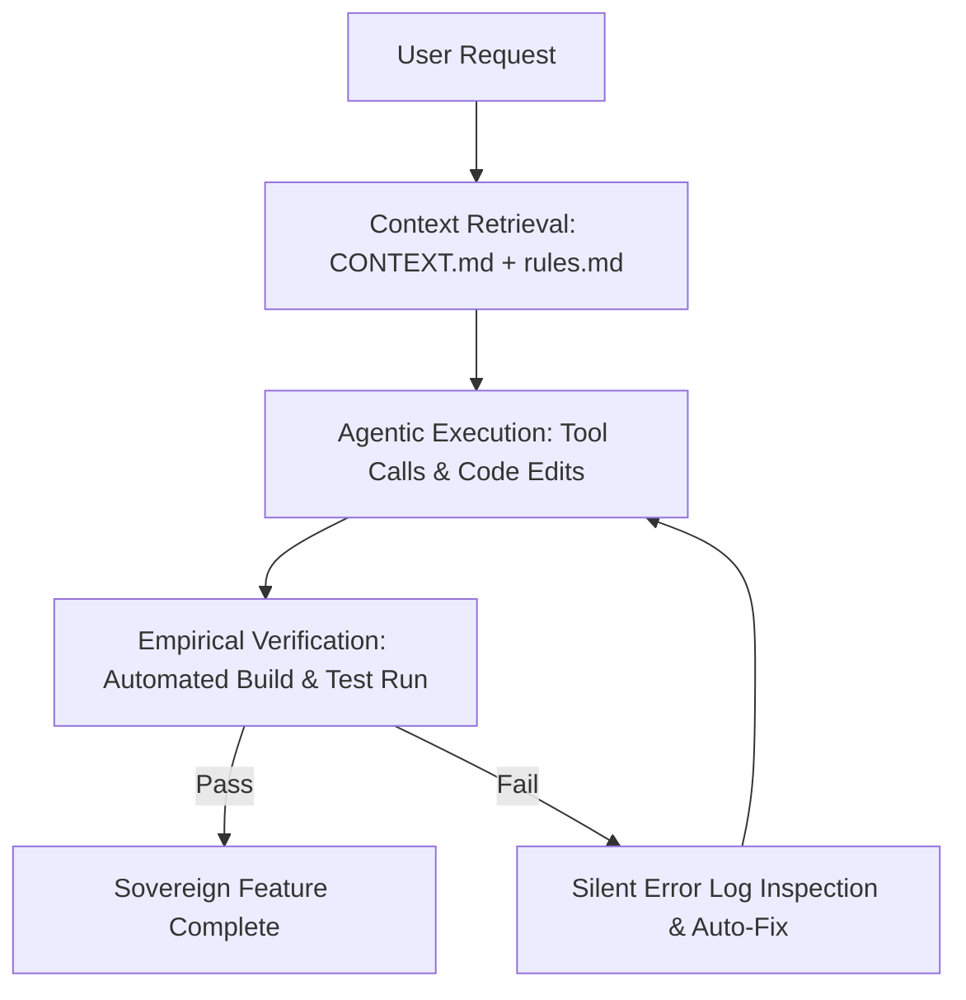

> [!KEY TAKEAWAY]
> An **Agentic Harness** transforms non-deterministic Large Language Models into high-precision engineering partners by surrounding the model with local workspace rules (`CONTEXT.md`, `.agents/rules.md`), tool registries (MCP), subagent delegation, and automated build verification loops. Grounding AI in local file context eliminates architectural drift and cognitive fatigue.

*This guide was designed for [Google Antigravity](https://antigravity.google/) users.*

> [!NOTE] Freedom of Context: Start Simple
> You do **not** need to enforce a rigid ADK harness structure when starting out. You can freely build high-value AI context using simple Markdown files containing your project instructions, rules, and context—I built all of my projects starting this way! The formal Agentic Harness framework (rules, skills, MCP APIs, subagents) is simply an optional architecture to scale your workflow as your projects grow.

# Why build context for your AI

When you interact with a Large Language Model (LLM) without structured project context, you are relying on a "blank slate." The AI has no memory of your coding conventions, folder structure, API schemas, or brand rules.

This leads to three major failure modes:
1. **Hallucination & Architectural Drift**: The AI writes generic code that imports non-existent functions or violates your project architecture.
2. **Cognitive Fatigue**: You waste time re-explaining system rules, file paths, and design tokens in every single prompt.
3. **Broken Vibe Coding**: Unconstrained "vibe coding" without context produces fragile code that fails silently during deployment.

> [!IMPORTANT] The Context Window Principle
> Grounding an AI in local project context bridges the gap between raw LLM (AI) capabilities and your exact project reality. By organizing your context into structured files, you index memory locally, eliminating noise and transforming AI into a high-precision execution partner.

---

# How to build context for an AI

Building context requires structuring your project folder so that AI tools (like Google Antigravity) can read your system rules automatically before generating code.

### The Antigravity Context Triad

Organize your project folder with three standardized context layers:

```text
my-project/
├── CONTEXT.md                  # Layer 1: High-Level Architecture & Goals
├── .agents/
│   └── rules.md                # Layer 2: Non-Negotiable Coding Rules & Constraints
└── skills/
    └── SKILL.md                # Layer 3: Reusable Workflow Cheatsheets & Prompts
```

#### Layer 1: `CONTEXT.md` (Project Goals & Architecture)
Create a `CONTEXT.md` (or `README.md`) file at the root of your project folder. Document the high-level purpose, tech stack, and key directory paths.

#### Layer 2: `.agents/rules.md` (Style & Constraints)
Define strict behavioral guidelines. Tell the AI what it is **never** allowed to do (e.g., "Never guess API schemas", "Always run build verification", "Never modify private DOM states").

#### Layer 3: `skills/` (Workflow Prompts)
Create domain-specific skill directories containing `SKILL.md` files. Skills act as step-by-step cheatsheets for complex workflows (e.g., setting up Stripe webhooks, running database migrations).

---

# What is an Agentic Harness

> [!KEY CONCEPT] Agentic Harness
> A deterministic software scaffolding that envelops a non-deterministic AI foundation model. It equips the model with workspace context (`CONTEXT.md`), strict operational constraints (`.agents/rules.md`), tool execution registries (Model Context Protocol / MCP), and automated verification test loops.

An **Agentic Harness** is the autonomous control environment that surrounds an AI agent. It consists of:
- **System Prompts & Rules**: Guiding behavioral boundaries.
- **Tool Registries (MCP Server APIs)**: Equipping the AI with real-world execution capabilities (reading files, executing commands, calling Stripe/Supabase APIs).
- **Subagent Delegation (Optional / Advanced)**: Spawning specialized background subagents (e.g., a *Researcher* subagent to read logs while the main agent codes).
- **Empirical Verification Loops**: Automatically running build and test commands after code modifications.

### Blank Slate Prompting vs. Grounded Agentic Harness

| Feature Dimension | Blank Slate AI Prompting | Grounded Agentic Harness |
| :--- | :--- | :--- |
| **Context Indexing** | Empty context window; relies on generic pre-training data | Deterministic local indexing via `CONTEXT.md` & `.agents/` |
| **Tool Execution** | Text generation only; cannot touch filesystem or APIs | Model Context Protocol (MCP) tool execution |
| **Error Handling** | Hallucinates plausible-sounding but broken fixes | Silent log inspection with automated test/build loop |
| **Multi-Tasking** | Single blocking conversational thread | Autonomous subagent background delegation |
| **Architectural Drift** | High (frequently violates conventions & schemas) | Zero (enforces strict style constraints in `rules.md`) |

### The Agentic Control Loop



---

# How to build an agentic harness

Follow this workflow to construct an agentic harness in your project:

### Step 1: Define Persona & System Prompt
Establish the identity and primary role of the agent in your context files.

### Step 2: Attach Tools & MCP Server APIs
Equip your harness with tools (Model Context Protocol / MCP) for filesystem access, shell execution, database inspection, and API integrations.

### Step 3: Declare Boundaries (The 4 Harness Imperatives)

> [!WARNING] The 4 Harness Imperatives
> 1. **Keep Context Files Concise**: Do not bloat context files with thousands of lines of raw code. Summarize schemas and point the agent to authoritative source files.
> 2. **Enforce Strict Control Flow Rules**: Require the agent to inspect error logs silently before attempting a fix.
> 3. **Always Require Empirical Verification**: Never declare a task complete until build commands (`npm run build` or test suites) pass cleanly.
> 4. **Never Guess API Schemas**: Force the agent to view complete file definitions before consuming method signatures or types.

### Step 4: Configure Subagent Delegation (Optional for Beginners)
*Note: As an Obsidian beginner, Steps 1 through 3 give you 90% of the power of an agentic harness. Subagent delegation is an optional, advanced feature used when you want the primary agent to spawn separate background workers for large-scale multi-tasking.*

---

# Copy-Paste Context Templates

### 1. Sample `.agents/rules.md` (Coding Conventions & Boundaries)

```markdown
# Project Rules & Control Flow Scoping

## Coding Conventions
- Use Next.js App Router and TypeScript with strict typing.
- Styling: Use Vanilla CSS or Tailwind tokens matching global design system.
- Preserve existing function signatures and docstrings.

## Non-Negotiable Boundaries
- NEVER attempt to fix bugs by commenting out broken tests or returning dummy fallbacks.
- NEVER guess API parameters or variable types; inspect the source file first.
- ALWAYS run `npm run build` after code edits to empirically verify clean compilation.
```

### 2. Sample `skills/deploy-workflow/SKILL.md` (Reusable Skill Cheatsheet)

```markdown
---
name: deploy-workflow
description: Standard operating procedure for verifying and deploying local Next.js builds.
---

# Deploy Workflow Skill

1. Run `npm run lint` to check for syntax errors.
2. Run `npm run build` to verify static page generation and server routes.
3. If build fails, inspect `build.log` silently and fix root cause tracebacks.
4. Push clean commit to production branch.
```

---

# Sovereign AI Manifesto & Google Antigravity

Mastering AI context and agentic harnesses is the key to **digital sovereignty**. Instead of relying on proprietary cloud platforms, you become the architect of an autonomous, local-first intelligence lab.

### How Google Antigravity Works

[Google Antigravity](https://antigravity.google/) is an advanced agentic AI development environment designed for high-velocity "vibe coding." 

- **Local Filesystem & Context First**: Antigravity reads your project's `.agents/` rules, `skills/`, and `CONTEXT.md` files directly from your workspace directory.
- **Model Context Protocol (MCP)**: Antigravity connects natively to tool servers (Stripe, Supabase, local terminal commands, browser evaluation).
- **Multi-Agent Orchestration**: Antigravity spawns background subagents to perform complex tasks concurrently, keeping your main development flow uninterrupted.

> [!TIP] Build Your Sovereign Estate
> By combining Obsidian's local-first knowledge vault with Google Antigravity's agentic harness, you transform your computer into an autonomous super-station.

[Download Google Antigravity](https://antigravity.google/)
