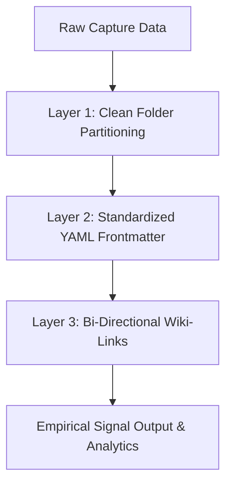

> [!KEY TAKEAWAY]
> **Empirical Signal Extraction** is the systematic filtering of raw data, media captures, and literature into validated, high-conviction insights by treating local Markdown files as structured, queryable database records. Moving beyond passive data hoarding, this methodology leverages Dataview queries, YAML taxonomies, and visual Canvas synthesis to power high-leverage decision-making.

## What is Empirical Signal Extraction?

**Empirical Signal Extraction is the transition from passive information consumption to active intelligence creation.** Collecting data is trivial in an era of information abundance—bookmarking dozens of articles or archiving hundreds of PDFs takes seconds. However, data hoarding without structure creates mental noise and cognitive fatigue. 

The objective of an empirical second brain is not storage capacity; it is the systematic extraction of actionable signals to guide creation, research, and high-stakes execution.

> "Data hoarding is not data science. An unqueried vault is a digital graveyard; a structured vault is an empirical signal engine."

---

## Passive Data Hoarding vs. Empirical Signal Extraction

| Dimension | Passive Data Hoarding | Empirical Signal Extraction (Hevel) |
| :--- | :--- | :--- |
| **Primary Activity** | Bookmarking, clipping, and archiving without indexing | Structuring, querying, and synthesizing into new assets |
| **Information Structure** | Unformatted text in deep folder hierarchies | Standardized YAML frontmatter & bi-directional wikilinks |
| **Retrieval Mode** | Fuzzy keyword search and manual folder browsing | SQL-like Dataview queries and visual Canvas dashboards |
| **Cognitive Outcome** | Information overload and mental fatigue | High-conviction clarity and actionable decision-making |
| **Tooling Stack** | Cloud read-it-later apps and browser tabs | Obsidian, Dataview, Excalidraw, and Agentic AI |

---

## Tools: Obsidian Canvas & Dataview Query Engine

To conduct empirical data science in local Markdown, you pair structured querying with visual spatial synthesis:

### 1. Obsidian Bases & Dataview (Structured Database Grids)
**Dataview transforms flat Markdown files into dynamic relational database tables.** Every note containing YAML frontmatter becomes a queryable database record.

```dataview
TABLE status, author, created, tags
FROM #Data OR #Data-Science
WHERE status = "Active"
SORT created DESC
```

### 2. Obsidian Canvas (Visual Spatial Synthesis)
**Obsidian Canvas provides an infinite non-linear visual workbench for mapping complex macro concepts.** Humans process spatial relationships faster than linear text lists. Canvas allows you to place Dataview tables, mindmaps, media captures, and PDF excerpts onto an interactive board to discover cross-disciplinary patterns.

#### Visual Canvas Dashboard Blueprint

```text
+-----------------------------------------------------------------------------------+
|                            OBSIDIAN DASHBOARD CANVAS                              |
|                                                                                   |
|  +---------------------------+               +---------------------------------+  |
|  |   DB FOLDER / DATAVIEW    |   ------->    |      EXCALIDRAW / CANVAS       |  |
|  |     QUERY GRID TABLE      |               |     CONCEPTUAL MAP BOARD        |  |
|  |  (Status, Tags, Metrics)  |   <-------    |   (Media, PDFs, Mindmaps)       |  |
|  +---------------------------+               +---------------------------------+  |
|                |                                              |                   |
|                v                                              v                   |
|  +-----------------------------------------------------------------------------+  |
|  |             KNOWLEDGE GRAPH SYNTHESIS (Bi-Directional Links)                |  |
|  +-----------------------------------------------------------------------------+  |
+-----------------------------------------------------------------------------------+
```

---

## The Tri-Layer Deep Organization Formula

To extract empirical signal systematically, apply the three foundational organizational layers:



1. **Layer 1: Clean Folder Partitioning (Scope)**: Partition vault into high-level functional containers (`Mobile/` for capture, `Repos/` for source code, `Vault/` for evergreen research).
2. **Layer 2: Standardized YAML Metadata (Attributes)**: Categorize notes with consistent properties (`type`, `status`, `tags`) to power Dataview queries.
3. **Layer 3: Bi-Directional Linking (Relationships)**: Connect notes with `[[wikilinks]]` to build an associative knowledge graph.

---

## ❓ Frequently Asked Questions (FAQ)

### How does Obsidian function as a Data Science platform?
**Obsidian treats the filesystem as a database.** By combining plain-text Markdown notes with YAML metadata, community plugins like Dataview and DB Folder allow you to run SQL-style queries, calculate metadata aggregations, and generate interactive database tables without leaving your local environment.

### What is the APPASA Protocol?
**The APPASA Protocol is a 6-stage empirical workflow: Ask, Prepare, Process, Analyze, Share, and Act.** It ensures that research moves systematically from an initial query to verified, real-world execution.

---

### 🔗 Related Notes & Core Concepts
- [[Atomic Notes/The APPASA Protocol|The APPASA Protocol for Data Analysis]]
- [[Atomic Notes/Global Optimization|Global Optimization & Systemic Architecture]]
- [[Atomic Notes/potential|Potential & Resource Conversion]]
- [[Obsidian/YAML|YAML Metacognition & Frontmatter Schemas]]
- [[Obsidian/How to build your vault|How to Build Your Sovereign Vault]]

