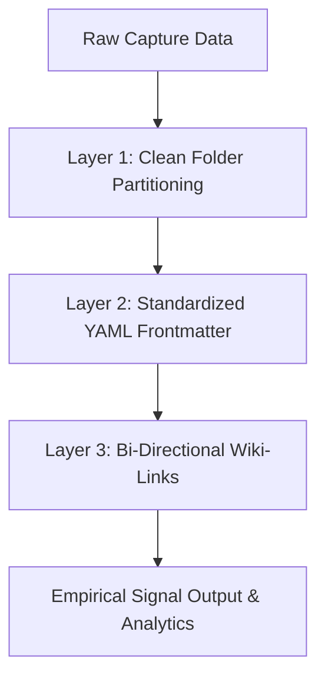

> [!KEY TAKEAWAY]
> **Empirical Signal Extraction** converts passive data hoarding into actionable intelligence by treating Markdown notes as structured database records queried via Dataview, categorized with strict YAML metadata, and synthesized visually on Obsidian Canvas.

# Data is Cool, But...

> [!KEY CONCEPT] Empirical Signal Extraction
> The systematic filtering of raw data points, media captures, and literature into validated, high-conviction insights and repeatable intellectual or digital assets.

Collecting data is easy. We live in an era of information abundance, where bookmarking 50 articles a day or copying hundreds of PDFs takes seconds. 

However, **data hoarding is not data science**. Passive accumulation creates cognitive noise and mental fatigue. The goal of a sovereign second brain is not to store endless data, but to extract **empirical signal** for creation, discoveries, and high-level decision making.

> [!IMPORTANT] The Signal Over Noise Principle
> Data Science in Obsidian converts raw text, media clips, and research into a **Big-Picture Dashboard**. By treating your notes as data points, you move from passive reading to active creation: building digital products, identifying emerging market trends, and discovering hidden connections across disciplines.

---

# Tools: Obsidian Bases & Canvas

To perform data science in Obsidian, you need two fundamental tools: one for visual synthesis, and one for structured querying.

### 1. Obsidian Canvas (Visual Synthesis & Mapping)
Obsidian Canvas is an infinite non-linear visual workbench. It allows you to drag notes, images, web bookmarks, PDFs, and Excalidraw diagrams onto a single interactive board.
- **Why use it**: Humans process spatial relationships faster than text lists. Canvas lets you group related data clusters visually, draw directional arrows between evidence and conclusions, and map out complex macro ideas.

### 2. Obsidian Bases & Dataview (Structured Database Grids)
Obsidian Bases (powered natively or via plugins like Dataview & DB Folder) turn your Markdown files into dynamic database tables—similar to SQL or Notion databases.
- **Why use it**: Every file with YAML frontmatter becomes a row in a queryable table. You can sort notes by creation date, filter by tag (`#Data-Science`), aggregate project status, or run mathematical summaries on metadata fields.

#### Visual Canvas Dashboard Blueprint

```text
+-----------------------------------------------------------------------------------+
|                            OBSIDIAN DASHBOARD CANVAS                              |
|                                                                                   |
|  +---------------------------+               +---------------------------------+  |
|  |   DB FOLDER / DATAVIEW    |   ------->    |      EXCALIDRAW / CANVAS       |  |
|  |     QUERY GRID TABLE      |               |     CONCEPTUAL MAP BOARD        |  |
|  |  (Status, Tags, Metrics)  |   <-------    |   (Media, PDFs, Mindmaps)       |  |
|  +---------------------------+               +---------------------------------+  |
|                |                                              |                   |
|                v                                              v                   |
|  +-----------------------------------------------------------------------------+  |
|  |             KNOWLEDGE GRAPH SYNTHESIS (Bi-Directional Links)                |  |
|  +-----------------------------------------------------------------------------+  |
+-----------------------------------------------------------------------------------+
```

---

# Best Practices: Deep Organization

High-level data analysis requires deep, systematic organization. To query your data, your data must be structured. The gold standard methodology is the **Tri-Layer Deep Organization Formula**:



### Layer 1: Clean Folder Partitioning (Scope)
Divide your vault into logical high-level containers (e.g., `Mobile/` for capture, `Repos/` for applications, `Vault/` for deep research). Folders define the broad **scope** or category of a file.

### Layer 2: Standardized YAML Metadata (Attributes)
Every file must have a YAML frontmatter header. Frontmatter defines the **attributes** of the file, allowing Dataview queries to filter and index notes programmatically.

```yaml
---
title: "Global Supply Chain Disruptions 2026"
type: Research
status: Active
author: Jason
pillar: 3 R&D
created: 2026-08-07
tags:
  - Data-Science
  - Geopolitics
metric_rating: 8.5
aliases:
  - Supply Chain Report
---
```

### Layer 3: Bi-Directional Internal Linking (Relationships)
Use `[[note-name]]` internal links to connect concepts associatively. Folders organize hierarchy; bi-directional links create the **knowledge graph**. Linking notes creates neural-like pathways in your graph view.

---

# Community Plugins: The Data Science Stack

To transform Obsidian into a full data analytics workstation, install these three core community plugins:

### 1. Dataview (SQL-Style Query Engine)
Dataview is the engine of data science in Obsidian. It turns your vault into a high-speed relational database using Dataview Query Language (DQL).

#### Example Dataview Query (Listing Active Research Notes):

```dataview
TABLE status, pillar, created, tags
FROM #Data OR #Data-Science
WHERE status = "Active"
SORT created DESC
```

### 2. Excalidraw (Visual Diagramming & Spatial Data)
Excalidraw embeds an infinite vector whiteboard directly inside your markdown notes. Use it to sketch data flowcharts, system architectures, and visual data models alongside your text notes.

### 3. DB Folder (Notion-Like Interactive Database Tables)
DB Folder transforms any folder of notes into an interactive table editor. You can edit YAML frontmatter properties directly from table cells, add new columns, and filter records without touching the raw note text.

---

# Summary Workflow
1. **Capture**: Save raw notes with clean YAML metadata (`type`, `status`, `tags`).
2. **Organize**: File the note into your structured partition (`Mobile/`, `Vault/`) and add bi-directional `[[links]]`.
3. **Query**: Use **Dataview** and **DB Folder** tables to inspect metrics, status, and frontmatter.
4. **Synthesize**: Map connections visually on **Canvas** and **Excalidraw** to discover big-picture insights and launch new projects.
